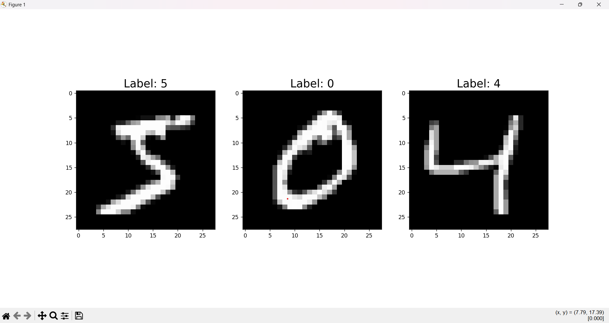
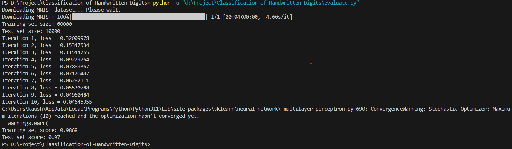

# Classification of Handwritten Digits

This project demonstrates the classification of handwritten digits using an MLP (Multi Layer Perceptron).

### Example Output:

Here is an example of a handwritten digit classified by the model:

Accuracy of the model on the training and test dataset.

